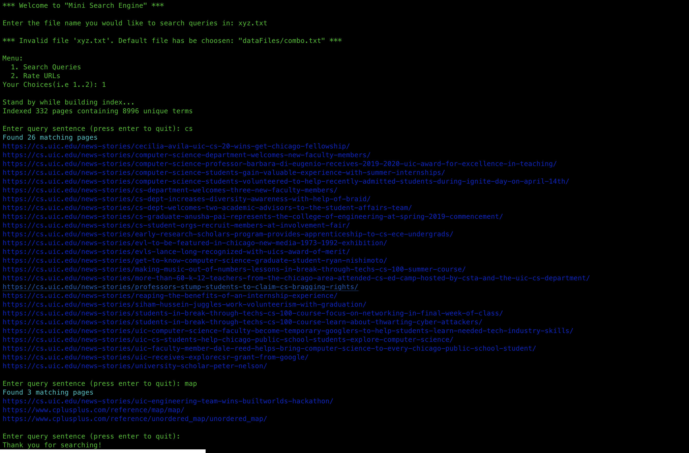

# MIni-Search-Engine

- A program for searching queries and providing relevant URLs.
- A program that can search for queries and provide relevant URLs is a useful tool for finding information on the internet. This type of program, also known as a search engine, allows users to enter a query using keywords, phrases, or other search terms, and provides a list of relevant URLs that match the query.

- The program works by using algorithms and other techniques to search through a large index of web pages and other online content. It identifies pages that contain the search terms entered by the user, and ranks them according to their relevance and quality. The program then displays the most relevant URLs to the user, along with a brief summary of each page's content.


Launch your Terminal and clone the repository. Clone it by using following command: 
```
git clone https://github.com/ubaka2/Mini-Search-Engine.git
```
After downloading the application, identify the place where it was downloaded to get started.

Call ```make run``` on your console to start the program. Enjoy 😉.
- Here is a screenshot of the application in action:


